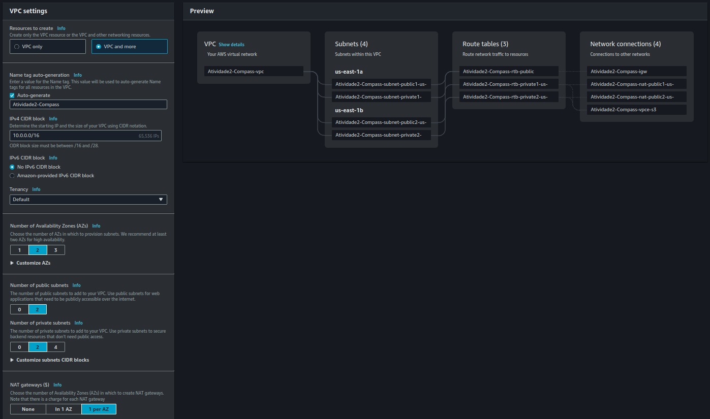
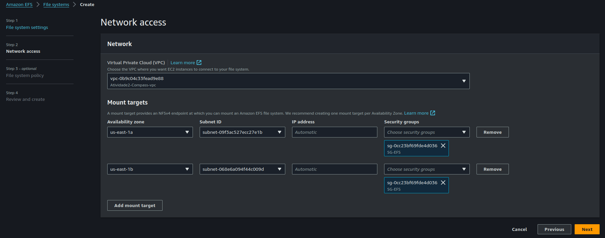
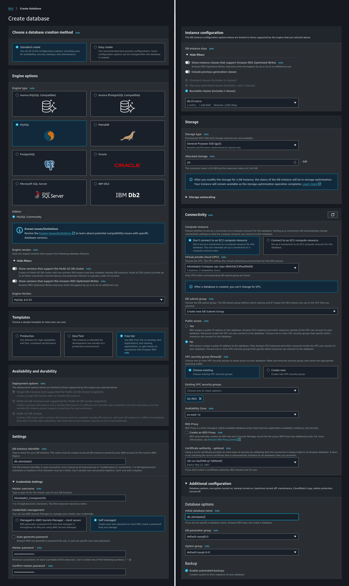
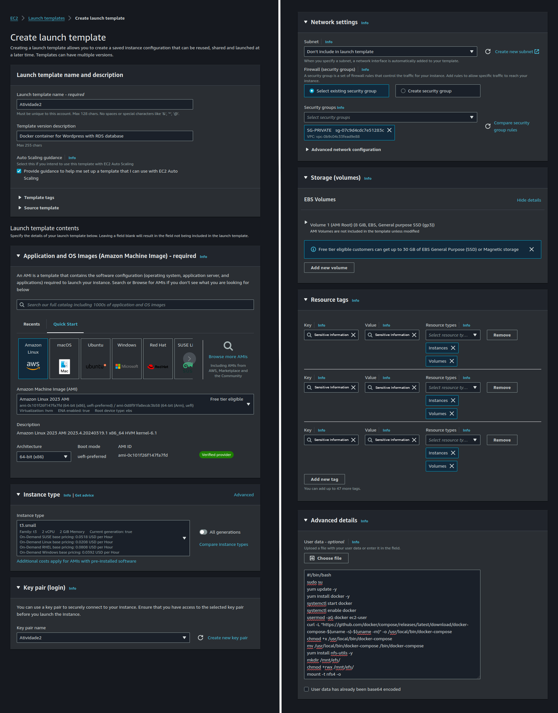
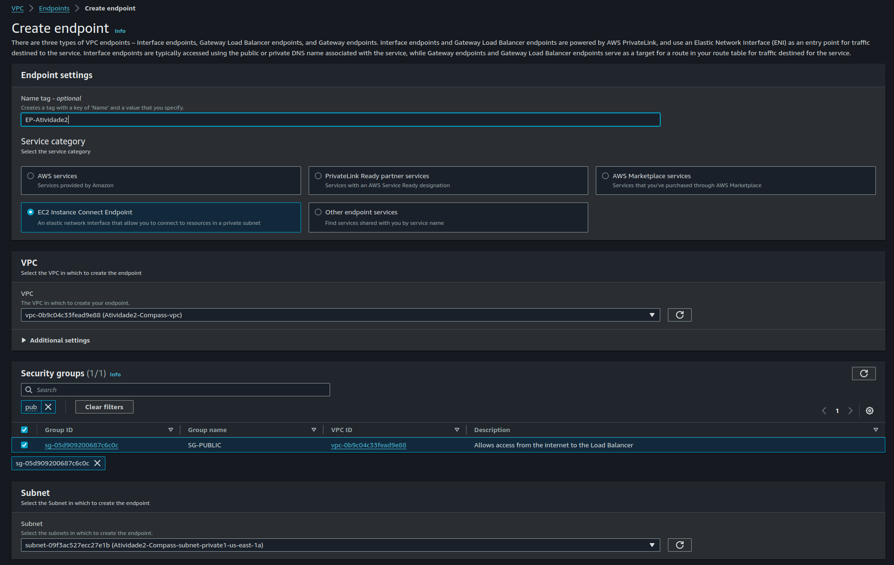

## 📚 Documentação

Objetivo:

- Instalação e configuração do DOCKER ou CONTAINERD no host EC2;

- Ponto adicional para o trabalho utilizar a instalação via script de Start Instance (user_data.sh)

- Efetuar Deploy de uma aplicação Wordpress com: container de aplicação RDS database Mysql

- Configuração da utilização do serviço EFS AWS para estáticos do container de aplicação Wordpress

- Configuração do serviço de Load Balancer AWS para a aplicação Wordpress

Pontos de atenção:

- Não utilizar ip público para saída do serviços WP (Evitem publicar o serviço WP via IP Público)
- Sugestão para o tráfego de internet sair pelo LB (Load Balancer Classic)
- Pastas públicas e estáticos do wordpress, sugestão de utilizar o EFS (Elastic File Sistem)
- Fica a critério de cada integrante usar Dockerfile ou Dockercompose;
- Necessário demonstrar a aplicação wordpress funcionando (tela de login)
- Aplicação Wordpress precisa estar rodando na porta 80 ou 8080;
- Utilizar repositório git para versionamento;


# | --- Parte prática --- |

## 1 - Criar uma Virtual Private Cloud

- Neste primeiro passo vamos selecionar VPC e criar uma nova, incluindo a marcação do Nat Gateway durante o processo de criação. 
- O Nat Gateway será utilizado para proporcionar conectividade à Internet para as instâncias privadas.
- Para isso, abra o menu de criação de VPC no console AWS -> Create VPC -> VPC and more.
- Number of Availability Zones = 2, Numbero of public subnets = 2, Number of private subnets = 2, NAT gateways = 1 per AZ.



## 2 - Criar os Security Groups

- Neste passo, vamos no menu de EC2 -> Network & Security ou VPC -> Security, Security Group -> Create Security Group.
- Criar os grupo as seguir com seus protocolos e origem:

[SG-PUBLIC](./Prints/Security%20Groups/SG-PUBLIC.png) - do Load Balancer
| Tipo            | Protocolo | Porta | Origem    |
|-----------------|-----------|-------|-----------|
| HTTP            | TCP       | 80    | 0.0.0.0/0 |
| HTTPS           | TCP       | 443   | ::/0      |

[SG-PRIVATE](./Prints/Security%20Groups/SG-PRIVATE.png) - das Instâncias EC2

| Tipo            | Protocolo | Porta | Origem    |
|-----------------|-----------|-------|-----------|
| HTTP            | TCP       | 80    | SG-PUBLIC |
| SSH             | TCP       | 22    | SG-PUBLIC |

[SG-EFS](./Prints/Security%20Groups/SG-EFS.png) - para conexão do NFS
| Tipo            | Protocolo | Porta | Origem     |
|-----------------|-----------|-------|------------|
| NFS             | TCP       | 2049  | SG-PRIVATE |

[SG-RDS](./Prints/Security%20Groups/SG-RDS.png) - para conexão do banco de dados
| Tipo            | Protocolo | Porta | Origem     |
|-----------------|-----------|-------|------------|
| MYSQL/AURORA    | TCP       | 3306  | SG-PRIVATE |

## 3 - Criar o Elastic File System

- Neste passo, vamos criar um EFS para utilização das pastas públicas e estáticos do wordpress, do container de aplicação Wordpress. 
- Vamos em EFS -> Create File System.
- Selecionar a VPC criada, as subnets privadas e o Security Group do EFS.



## 4 - Criar o Relational Database Service

- Neste passo, vamos criar o banco de dados para o container de aplicação RDS - Mysql.
- Vamos em Amazon RDS -> Dashboard -> Create database.
- Selecionar MySQL, Template = Free Tier.
- Criar username e password, selecionar o tipo de instância e storage.
- Como não criei o template das instâncias ainda, vou selecionar em não conectar à uma instância EC2.
- Não selecionar acesso público!
- Selecionar a VPC e o Security Group criados.
- Criar um nome inicial do Database.



## 5 - Criar o Template de Instâncias

- Como vamos trabalhar com auto scaling, é essencial criar um template já com os detalhes do que vamos querer instalar na imagem.
- Imagina ter que configurar manualmente toda instância que sobe quando o workload aumenta? Seria muito oneroso.
- Para isso iremos em EC2 -> Launch Templates -> Create launch template.

- Neste passo, vamos criar uma instância Amazon Linux t3.small
- Criar uma chave SSH
- Conectá-la ao security group SG-PRIVATE
- Colocar as tags pertinentes ao PB
- Incluir o user_data.sh para instalar o docker, wordpress e nfs-utils; montar o efs e criar o yaml para conectar ao rds.

<details>
  <summary>user_data.sh</summary>

  ```
  #!/bin/bash
  sudo su
  yum update -y
  yum install docker -y
  systemctl start docker
  systemctl enable docker
  usermod -aG docker ec2-user
  curl -L "https://github.com/docker/compose/releases/latest/download/docker-compose-$(uname -s)-$(uname -m)" -o /usr/local/bin/docker-compose
  chmod +x /usr/local/bin/docker-compose
  mv /usr/local/bin/docker-compose /bin/docker-compose
  yum install nfs-utils -y
  mkdir /mnt/efs/
  chmod +rwx /mnt/efs/
  mount -t nfs4 -o nfsvers=4.1,rsize=1048576,wsize=1048576,hard,timeo=600,retrans=2,noresvport ID_DO_SEU_EFS.efs.us-east-1.amazonaws.com:/ /mnt/efs
  echo "ID_DO_SEU_EFS.efs.us-east-1.amazonaws.com:/ /mnt/efs nfs defaults 0 0" >> /etc/fstab
  echo "version: '3.8'
  services:
    wordpress:
      image: wordpress:latest
      volumes:
        - /mnt/efs/wordpress:/var/www/html
      ports:
        - 80:80
      restart: always
      environment:
        WORDPRESS_DB_HOST: ENDPOINT DO SEU RDS
        WORDPRESS_DB_USER: MASTER USERNAME DO SEU RDS
        WORDPRESS_DB_PASSWORD: MASTER PASSWORD DO SEU RDS
        WORDPRESS_DB_NAME: INITIAL NAME DO SEU RDS
        WORDPRESS_TABLE_CONFIG: wp_" | sudo tee /mnt/efs/docker-compose.yml
  cd /mnt/efs && sudo docker-compose up -d
  ```
</details>



## 6 - Criar o Load Balancer

- Neste passo vamos criar o LB.
- Para isso vamos em EC2 -> Load Balancing -> Load Balancers -> Create load balancer.
- Foi sugerido usar o Classic Load Balancer.
- Em basic information seleciona o scheme Internet-facing
- Selecione A VPC criada anteriormente
- Em Mappings marque as duas Az's e selecione as duas Subnets Públicas
- Selecione o SG-PUBLIC para acesso à internet
- Em Listeners e Routing, vou colocar as portas http:80 e tcp:22
- Em Health checks, vou selecionar tcp:80


## 7 - Criar o EndPoint
- Este Endpoint serve de túnel da internet para às instâncias via SSH que não têm IP público.
- Neste passo, para criá-lo vamos em VPC -> Endpoints -> Create endpoint
- Em Service Category selecionar EC2 Instance Connect Endpoint
- Em VPC, selecionar a anterior criada
- Em Security Group selecionar a SG-PUBLIC
- Em subnet, selecionar a private-1a



## 8 - Criar o Auto Scaling

- Essencial para escalabilidade da aplicação
- Ele aumenta ou diminui as instâncias de acordo com a necessidade, impedindo que sua aplicação fique fora do ar por falta de recursos e evita gastos desnecessários.
- Neste passo, para criar o ASG iremos em EC2 -> Auto Scaling -> Auto Scaling Groups e Create Auto Scaling Groups.
- Selecione o Template criado anteriormente, a VPC e as 2 Subnets Privadas.
- Attach to an existing load balancer - Choose from Classic Load Balancers, escolher o load Balancer criado
- Health Check é recomendado ligar o ELB health checks
- Para o group Size vou colocar como Desire capacity = 2, Min = 2 e Max = 4.
- Em target tracking, vou ativar o automatic scaling para 80% de utilização da CPU.


# | --- Teste --- |

- Neste passo, se tudo estiver configurado corretamente, podemos acessar a aplicação pelo DNS do Load Balancer (e não pelo IP das instâncias).

